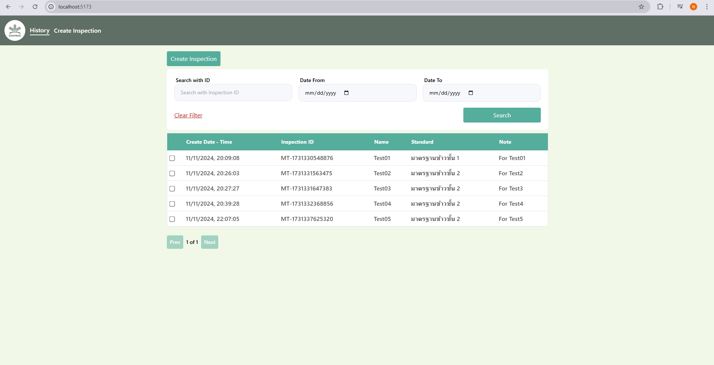
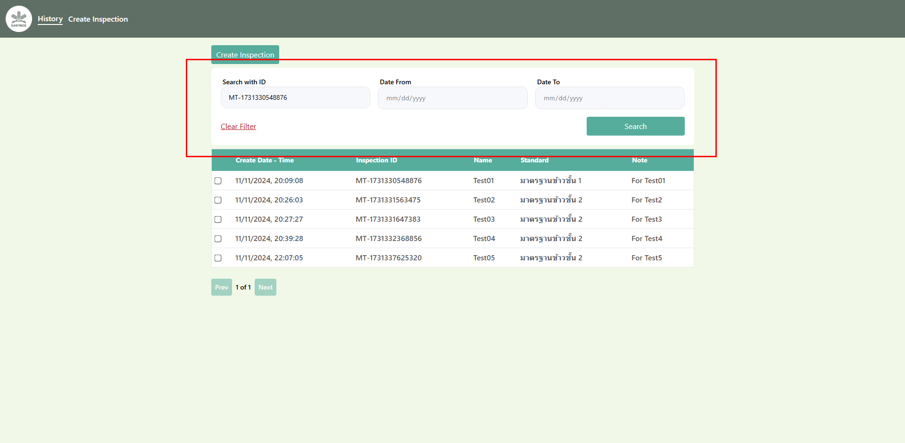
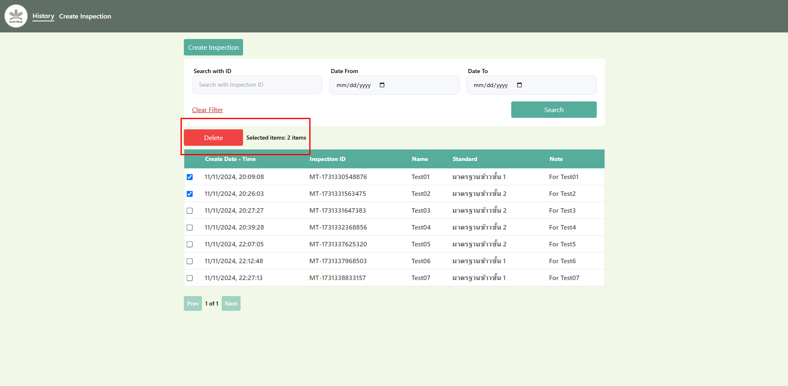
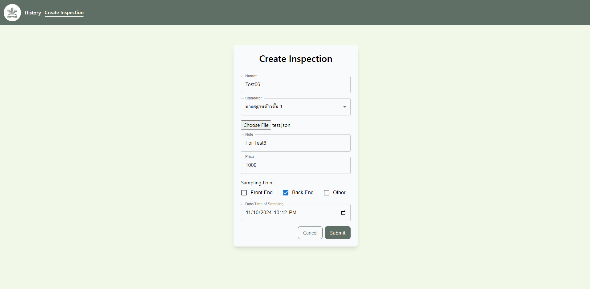
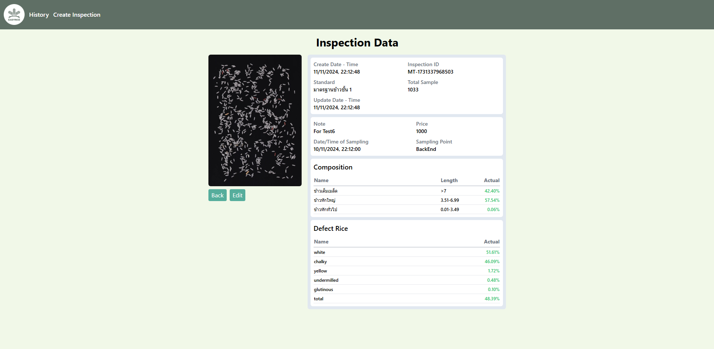
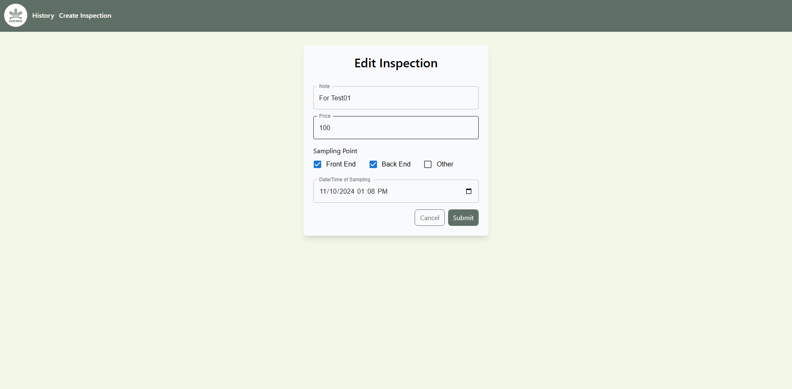

## Name: Nuttanan Ruangpanich

### Set up Project Frontend

```
git clone https://github.com/Nuttanan29445/Assignment.git
cd easy-rice-frontend
npm install
npm run dev
```

### Set up Project Backend

```
git clone https://github.com/Nuttanan29445/Assignment.git
cd easy-rice-backend
npm install
npm start
```

## How to use this website?

### Step1: History Page

- After set up project, you will be taken to the history page which shows a list of history.



- You can search the history by either inspection ID or date. If you choose to search by inspection ID, you will not be able to search by date at the same time.



- You can select checkboxes and delete histories.



### Step2: Create Inspection Page

- On this page, you will be asked to Create an Inspection.



### Step3: Result by Id Page

- After completing the inspection form, you will be taken to the Result page, which contains details that can be edited.



### step4: Edit page

- On this page you can edit various sections.


